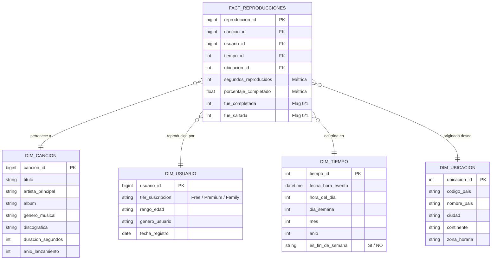

# Actividad 3: Caso Práctico - Arquitectura de Datos y Análisis para Plataforma de Streaming Musical

**Materia:** Optativa 3 - Ciencia de Datos  
**Semana 6:** Fundamentos de Ingeniería de Datos  
**Estudiante:** Samir Mares Benvenuto  

---

## 🎧 Contexto del Problema

Una plataforma global de streaming musical gestiona tres fuentes de datos heterogéneas:
1. **Eventos de reproducción por usuario:** Millones de pulsaciones/eventos por minuto (telemetría cruda: *song_started*, *song_finished*, *skipped*, *timestamp*, *geo_ip*, *device_id*).
2. **Catálogo musical:** Metadatos de canciones, álbumes, artistas y sellos discográficos (actualizaciones moderadas, varias veces al día).
3. **Suscripciones y cobros:** Facturación recurrente y pagos de usuarios (transacciones mensuales agrupadas en lotes).

### Requerimientos de Negocio:
* **Requerimiento 1 (Analítico):** Un *Dashboard* de tendencias musicales actualizado para la toma de decisiones comerciales y operativas.
* **Requerimiento 2 (Seguridad / Anti-fraude):** Detección inmediata en tiempo real si una cuenta de usuario se está compartiendo simultáneamente desde múltiples países o ubicaciones geográficas incompatibles.

---

## 📌 a) Selección de Paradigma de Procesamiento por Fuente (Batch vs. Streaming)

| Fuente de Datos | Volumen / Frecuencia | Paradigma Recomendado | Justificación Técnica y Operativa |
| :--- | :--- | :--- | :--- |
| **1. Eventos de Reproducción** | Masivo (millones/minuto), flujo ininterrumpido | **Streaming** *(Híbrido con Micro-batching)* | La telemetría de eventos requiere procesamiento en streaming (mediante tecnologías como Apache Kafka + Apache Flink / Spark Streaming) por dos motivos: primero, para alimentar el motor de detección de fraude en tiempo real (múltiples IPs geográficamente distantes en minutos); segundo, para calcular métricas de tendencias en ventanas de tiempo deslizantes (*sliding windows*) sin saturar la memoria del sistema. Posteriormente, se consolidan en micro-lotes para el histórico analítico. |
| **2. Catálogo de Canciones** | Volumen medio, actualizaciones periódicas (varias veces al día) | **Batch (Micro-lotes programados)** | Los lanzamientos de discos, cambios de nombres o modificaciones de licencias ocurren a intervalos discretos. Un pipeline por lotes ejecutado cada pocas horas (o mediante eventos CDC - *Change Data Capture*) es óptimo, evitando el costo y la sobrecarga computacional de mantener un consumidor de streaming activo las 24 horas para datos que no cambian a cada milisegundo. |
| **3. Suscripciones de Pago** | Volumen transaccional acotado, periodicidad mensual | **Batch (Procesamiento por Lotes)** | Las liquidaciones bancarias, cobros recurrentes de tarjetas y renovaciones de planes ocurren en ciclos de facturación mensuales fijos. No existe valor de negocio en procesar facturación mensual en streaming; un job batch nocturno/mensual garantiza atomicidad (ACID), conciliación bancaria precisa y reportes contables consolidados con mínimo consumo de recursos. |

---

## 🏛️ b) Estrategia de Almacenamiento: Data Warehouse, Data Lake o Lakehouse

### 1. Almacenamiento para los Eventos de Reproducción Crudos: **Lakehouse (o Data Lake)**
* **Recomendación:** Se deben almacenar en un **Lakehouse** (construido sobre un Data Lake de almacenamiento de objetos como AWS S3 o Azure ADLS Gen2, con capas de tablas abiertas como **Delta Lake** o **Apache Iceberg**).
* **Justificación:**
  * **Volumen y Costo:** Guardar billones de eventos crudos en un Data Warehouse tradicional sería financieramente inviable y saturaría el almacenamiento especializado.
  * **Flexibilidad y Linaje:** El Data Lake/Lakehouse preserva los eventos semiestructurados (JSON con esquemas cambiantes) en su estado original (Capa Bronce).
  * **Evolución con Lakehouse:** La arquitectura Lakehouse agrega metadatos transaccionales (soporte ACID, viajes en el tiempo, compactación automática de archivos Parquet), permitiendo que tanto herramientas de streaming (Flink) como de Machine Learning lean datos masivos de forma eficiente sin sacrificar gobierno.

### 2. Almacenamiento para el Catálogo Estructurado y el Dashboard: **Data Warehouse**
* **Recomendación:** Almacenar en un **Data Warehouse** (ej. Snowflake, Google BigQuery o capa Gold de un Lakehouse optimizada para OLAP).
* **Justificación:**
  * **Rendimiento de Consultas Analíticas (OLAP):** El catálogo de canciones y las métricas pre-agregadas del dashboard de tendencias exigen lecturas SQL con latencias de milisegundos para usuarios concurrentes (ejecutivos, directores de marketing y sellos discográficos).
  * **Modelado Relacional e Integridad:** Los datos están altamente estructurados, tipados y gobernados, lo que permite aprovechar índices columnarizados, compresión avanzada y cachés de consulta propios de un Data Warehouse.

---

## 🌟 c) Diseño del Modelo Dimensional: Esquema Estrella para Tendencias Musicales

Para potenciar el análisis analítico de tendencias musicales con mínima sobrecarga de uniones (`JOINs`), se define un **Esquema Estrella** compuesto por una tabla de hechos central y cuatro dimensiones circundantes.

### Diagrama del Esquema Estrella (Mermaid)

### Justificación del Diseño:
* **Granularidad de la Tabla de Hechos (`fact_reproducciones`):** Cada fila representa un evento individual de escucha de una canción por un usuario.
* **Métricas Aditivas y Semi-aditivas:** Almacena métricas continuas (`segundos_reproducidos`) e indicadores booleanos (`fue_completada`, `fue_saltada`) que facilitan calcular de inmediato KPIs como:
  * Canciones más escuchadas por género, país y franja horaria.
  * Tasa de retención (*skip rate*) por artista o álbum.
  * Volumen de reproducción segmentado por usuarios gratuitos vs. suscriptores de pago.

---

## 🚨 d) Justificación Crítica: Inadecuación de un Pipeline Batch para Detección de Cuentas Compartidas

El requerimiento de negocio estipula: *"detectar en el momento si un usuario está compartiendo su cuenta desde varios países a la vez"*.

Un pipeline tradicional **Batch** que corre cada medianoche es **completamente inadecuado y fallido** para este propósito por las siguientes razones:

1. **Ventana de Imposibilidad Física (Teletransportación Geográfica / Velocidad de Viaje):**
   * El fraude por cuenta compartida se detecta identificando eventos concurrentes o cercanos en el tiempo desde coordenadas geográficas incompatibles (por ejemplo, una reproducción que inicia en Ciudad de México a las 14:00:00 y otra para el mismo usuario que inicia en Madrid a las 14:02:15).
   * En streaming, una regla de **Procesamiento de Eventos Complejos (CEP)** evalúa la diferencia de tiempo ($\Delta t$) y la distancia geográfica ($\Delta d$). Si $\frac{\Delta d}{\Delta t} > 900 \text{ km/h}$, se activa una alerta en milisegundos y se bloquea la sesión activa no autorizada o se solicita doble factor de autenticación (2FA).

2. **Acción Póstuma e Inutilidad Operativa del Batch Nocturno:**
   * Si el job corre a las 00:00 horas, la detección ocurrirá hasta **24 horas después** de que ambos usuarios terminaron de escuchar su música.
   * Para ese momento, las sesiones fraudulentas ya concluyeron, los recursos de red y las regalías a discográficas ya fueron consumidos, y el infractor disfrutó del servicio sin ninguna restricción.

3. **Falsos Positivos por Sesiones Expiradas:**
   * Al analizar datos acumulados de 24 horas en un lote, distinguir si dos reproducciones correspondieron a una persona real que tomó un vuelo internacional durante el día versus dos personas distintas escuchando al mismo segundo se vuelve computacionalmente complejo si no se preserva la correlación de estados de sesión en caliente.

**Conclusión Técnica:** La detección de anomalías y fraudes de geolocalización requiere obligatoriamente una arquitectura de **Streaming en tiempo real** (motor de reglas con Kafka + Apache Flink / Spark Structured Streaming / Redis In-Memory State), mientras que los reportes de tendencias y analítica agregada pueden alimentarse de la capa analítica del Data Warehouse.
