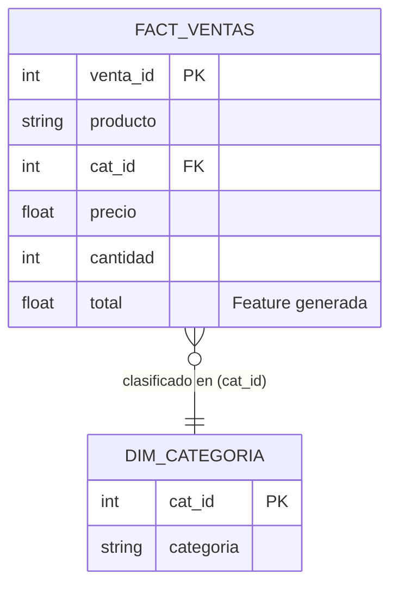

# Práctica: Pipeline ETL y Modelado Dimensional (Semana 6)

**Materia:** Optativa 3 - Ciencia de Datos  
**Tema:** Fundamentos de Ingeniería de Datos: Arquitecturas, ETL y Modelado Dimensional  
**Estudiante:** Samir Mares Benvenuto  

---

## 🎯 Objetivo de la Práctica

Diseñar, implementar y verificar un **pipeline ETL (*Extract, Transform, Load*) completo en Python**, modelando los datos transaccionales de ventas mediante un **esquema dimensional en estrella** (*Star Schema*) e integrándolos en una base de datos relacional SQLite (`almacen.db`) para su consulta analítica (OLAP).

---

## 📁 Estructura de la Carpeta

```text
semana06_ingenieria_datos/
├── ventas.csv                 # Dataset fuente de ventas transaccionales (15 registros)
├── etl.py                     # Script ejecutable del pipeline ETL
├── semana06_pipeline_etl.ipynb# Jupyter Notebook interactivo documentado paso a paso
├── almacen.db                 # Base de datos SQLite generada tras la ejecución
├── 01_foro_mediacion.md       # Respuesta reflexiva al foro y réplicas con citas
├── 03_caso_practico.md        # Análisis de arquitectura y caso streaming musical
├── 04_quiz_autoevaluacion.md  # Respuestas justificadas del quiz
├── entrega_semana06.md        # Documento consolidado con las 4 actividades
└── README.md                  # Documentación técnica de la práctica ETL
```

---

## 🔄 Descripción Detallada de las Fases del Pipeline ETL

### 1. Fase EXTRACT (Extracción)
* **Fuente:** Archivo tabular `ventas.csv`.
* **Mecanismo:** Lectura mediante la librería `pandas.read_csv()`.
* **Operación:** Se ingestan 15 transacciones comerciales con los campos: `producto` (texto), `categoria` (texto), `precio` (numérico decimal) y `cantidad` (entero).
* **Validación:** Se confirma la integridad de lectura, conteo de filas y tipos de datos.

### 2. Fase TRANSFORM (Transformación e Ingeniería de Features)
* **Ingeniería de Características (*Feature Engineering*):**
  Se genera una nueva variable cuantitativa:
  $$\text{total} = \text{precio} \times \text{cantidad}$$
  que representa el ingreso monetario bruto de cada transacción individual.
* **Modelado Dimensional (Esquema Estrella):**
  Para separar la lógica analítica de la transaccional, se descompone la estructura plana en:
  1. **Dimensión de Categoría (`dim_categoria`):**
     * Extrae las categorías únicas del negocio: *Alimentos Preparados*, *Bebidas Calientes*, *Bebidas Frías*, *Panadería*, *Snacks y Dulces*.
     * Genera una clave subrogada (*surrogate key*) numérica `cat_id` como clave primaria (PK).
  2. **Tabla de Hechos (`fact_ventas`):**
     * Asocia cada transacción mediante un `MERGE` con `dim_categoria` usando la clave `cat_id` (clave foránea / FK).
     * Preserva las métricas cuantitativas aditivas: `precio`, `cantidad` y `total`.
     * Asigna un identificador de evento único `venta_id`.



### 3. Fase LOAD (Carga)
* **Destino:** Base de datos relacional embebida `almacen.db` (SQLite 3).
* **Persistencia:** Mediante el método `.to_sql(..., conn, if_exists="replace", index=False)` de Pandas.
* **Resultado:** Se crean e indexan físicamente las tablas `dim_categoria` y `fact_ventas`, listas para ejecutar consultas SQL de alta velocidad sin dependencias externas complejas.

---

## ⚡ Ejecución del Pipeline

Para ejecutar el pipeline desde la terminal:

```bash
# 1. Asegúrate de tener las dependencias instaladas
pip install pandas

# 2. Ejecutar el script ETL
python semana06_ingenieria_datos/etl.py
```

---

## 📊 Salida de la Ejecución y Verificación SQL

A continuación se presenta la salida real obtenida de la ejecución de `etl.py`:

```text
=================================================================
>>> INICIANDO PIPELINE ETL - SEMANA 6: INGENIERIA DE DATOS <<<
=================================================================

[1/3] FASE EXTRACT (Extraccion)
-> Datos extraidos exitosamente desde 'ventas.csv'
-> Total de filas extraidas: 15

Muestra de datos crudos (primeras 3 filas):
          producto         categoria  precio  cantidad
     Cafe Espresso Bebidas Calientes    35.0         3
Capuchino Vainilla Bebidas Calientes    48.0         2
   Te Verde Matcha Bebidas Calientes    52.0         1

[2/3] FASE TRANSFORM (Transformacion y Modelado Dimensional)
-> Feature creada: 'total' = precio * cantidad
-> Dimension generada: 'dim_categoria' (5 categorias)
 cat_id            categoria
      1 Alimentos Preparados
      2    Bebidas Calientes
      3        Bebidas Frias
      4            Panaderia
      5      Snacks y Dulces

-> Tabla de hechos generada: 'fact_ventas' (15 registros)
 venta_id                 producto  cat_id  precio  cantidad  total
        1            Cafe Espresso       2    35.0         3  105.0
        2       Capuchino Vainilla       2    48.0         2   96.0
        3          Te Verde Matcha       2    52.0         1   52.0
        4 Croissant de Mantequilla       4    28.0         4  112.0
        5      Muffin de Arandanos       4    32.0         2   64.0

[3/3] FASE LOAD (Carga)
-> Tablas 'dim_categoria' y 'fact_ventas' persistidas exitosamente en 'almacen.db'

=================================================================
CONSULTA ANALITICA SQL (JOIN DE HECHOS Y DIMENSION)
=================================================================
           categoria  num_ventas  unidades_vendidas  precio_promedio  ingresos_totales
Alimentos Preparados           3                  6            78.33             466.0
       Bebidas Frias           3                  7            51.67             352.0
     Snacks y Dulces           3                 12            26.00             304.0
   Bebidas Calientes           3                  6            45.00             253.0
           Panaderia           3                  7            35.00             221.0
=================================================================
>>> Pipeline ETL completado con exito. <<<
```

---

## 📈 Hallazgos del Negocio a partir de la Consulta Analítica

1. **Categoría Líder en Facturación:** `Alimentos Preparados` lidera los ingresos con **$466.00**, impulsada por un ticket promedio alto ($78.33), a pesar de registrar un volumen moderado de unidades (6 unidades).
2. **Categoría de Mayor Rotación en Volumen:** `Snacks y Dulces` generó el mayor número de unidades vendidas (**12 unidades**) con un precio promedio accesible ($26.00).
3. **Eficiencia del Esquema Estrella:** La consulta analítica sólo requirió un único `INNER JOIN` entre la tabla de hechos y la dimensión para responder de manera instantánea a los requerimientos del tablero directivo.
